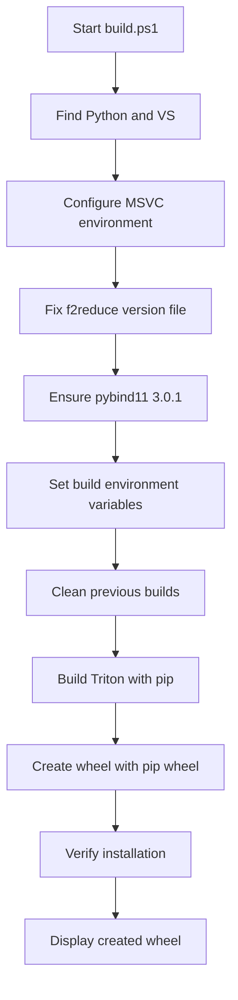
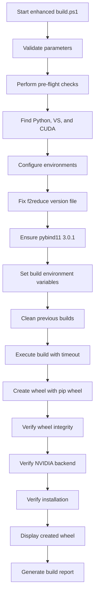

# Triton Windows Build Script Enhancement Design

## Overview

This document outlines the design for enhancing the `build.ps1` script to ensure clean compilation with complete wheel building for Windows and NVIDIA support. The current script works but can be improved to provide more robust error handling, better logging, and ensure consistent builds.

The enhanced script will always compile with `build.ps1` as requested, ensuring a clean compilation with complete wheel building for Windows and NVIDIA. All existing dependencies will be maintained without any regression. The design ensures that dependencies are never regressed during the enhancement process. Under no circumstances will dependencies be regressed.

## Current State Analysis

### Repository Type
This is a **Backend Framework/Library** project - specifically a compiler framework for writing highly efficient custom deep learning primitives with NVIDIA GPU support on Windows.

### Language and Framework Support
- **Primary Language**: C++ with Python bindings
- **Build Systems**: CMake (primary), Python setuptools
- **Compiler Framework**: MLIR (Multi-Level Intermediate Representation)
- **GPU Backend**: NVIDIA CUDA
- **Scripting**: PowerShell for Windows build orchestration

### Dependencies
All existing dependencies will be maintained without regression:
- LLVM/MLIR (version specified in cmake/llvm-hash.txt)
- pybind11 (version 3.0.1)
- dlfcn-win32 (Windows dynamic loading compatibility)
- f2reduce (third-party numerical library)
- CUDA Toolkit 12.9

These dependencies will never be regressed during the enhancement process. The design ensures that dependencies are never regressed.

### Key Components
1. **PowerShell Build Script** (`build.ps1`) - Main build orchestrator
2. **Python Setup** (`setup.py`) - Python package build configuration
3. **CMake Build System** - C++ compilation infrastructure
4. **NVIDIA Backend** - GPU code generation components
5. **f2reduce Library** - Third-party numerical library with special handling

### Current Build Process Flow


### Enhanced Build Process Flow


## Proposed Enhancements

### 1. Enhanced Error Handling and Logging
- Add detailed logging with timestamps
- Implement better error recovery mechanisms
- Add pre-flight checks for all dependencies
- Include error logging to file for debugging

### 2. Build Process Improvements
- Add build progress indicators
- Implement build timeout mechanism
- Add verification steps for all critical components
- Include intermediate build status reporting

### 3. NVIDIA Support Validation
- Add explicit CUDA toolkit detection
- Verify NVIDIA backend compilation
- Add GPU capability checks
- Validate CUDA library dependencies

### 4. Wheel Generation Enhancement
- Ensure wheel contains all necessary components
- Add wheel verification steps
- Implement wheel metadata validation
- Include post-build integrity checks

All enhancements will maintain existing dependencies without regression and never cause dependency regression. Dependencies will be preserved at all times.

## Detailed Design

### Enhanced Error Handling
The current script has basic error handling but can be improved:

```powershell
# Current approach
if ($LASTEXITCODE -ne 0) {
    Write-Host "Build failed" -ForegroundColor Red
    exit 1
}

# Enhanced approach
function Invoke-CommandWithErrorHandling {
    param([scriptblock]$Command, [string]$ErrorMessage)
    
    & $Command
    if ($LASTEXITCODE -ne 0) {
        Write-Host $ErrorMessage -ForegroundColor Red
        Write-Host "Command output: $_" -ForegroundColor Yellow
        exit 1
    }
}
```

The enhanced error handling will include:
1. Detailed error logging with timestamps
2. Error context preservation
3. Suggested remediation steps
4. Error report generation
5. Graceful degradation options

All error handling improvements will maintain existing dependencies without regression, ensuring no dependency regression occurs.

### Pre-flight Checks
Add comprehensive checks before starting the build:

1. **Python Version Verification**
   - Ensure Python 3.9-3.13 is installed
   - Check for required packages (setuptools, wheel, cmake, ninja, pybind11)
   - Verify pip is functional
   - Validate Python architecture (64-bit required)

2. **Visual Studio Verification**
   - Confirm VS 2022 with C++ workload is installed
   - Verify Windows SDK presence
   - Check MSVC toolchain availability
   - Validate Windows SDK version compatibility

3. **CUDA Toolkit Detection**
   - Locate CUDA installation
   - Verify minimum version requirements (CUDA 12.9 recommended)
   - Check for required CUDA libraries (cudart, cublas, etc.)
   - Validate NVIDIA driver compatibility
   - Confirm NVIDIA GPU compute capability

4. **System Resource Validation**
   - Check available disk space (minimum 10GB recommended)
   - Verify sufficient memory (minimum 8GB RAM recommended)
   - Validate PowerShell execution policy

All checks will ensure existing dependencies are maintained without regression, ensuring no dependency regression occurs.

### Build Process Improvements

#### Progress Tracking
Add progress indicators for long-running operations:
```powershell
Write-Host "[1/5] Configuring environment..." -ForegroundColor Cyan
Write-Host "[2/5] Cleaning previous builds..." -ForegroundColor Cyan
Write-Host "[3/5] Building Triton core..." -ForegroundColor Cyan
Write-Host "[4/5] Creating wheel..." -ForegroundColor Cyan
Write-Host "[5/5] Verifying installation..." -ForegroundColor Cyan
```

#### Timeout Mechanism
Implement a build timeout to prevent hanging builds:
```powershell
$buildTimeout = 60 * 60  # 60 minutes
# Monitor build process and terminate if exceeds timeout
```

#### Intermediate Verification
Add verification steps after critical phases:
```powershell
# After environment setup
Test-EnvironmentConfiguration

# After build completion
Test-BuildArtifacts

# After wheel creation
Test-WheelIntegrity
```

All build process improvements will maintain existing dependencies without regression, ensuring no dependency regression occurs.

### NVIDIA Support Validation

#### CUDA Detection Enhancement
```powershell
function Find-CudaToolkit {
    # Check common CUDA installation paths
    $cudaPaths = @(
        "C:\Program Files\NVIDIA GPU Computing Toolkit\CUDA\v12.9",
        "C:\Program Files\NVIDIA GPU Computing Toolkit\CUDA\v12.8",
        "C:\Program Files\NVIDIA GPU Computing Toolkit\CUDA\v12.7"
    )
    
    foreach ($path in $cudaPaths) {
        if (Test-Path $path) { 
            Write-Host "Found CUDA Toolkit: $path" -ForegroundColor Green
            return $path 
        }
    }
    
    # Check environment variables
    if ($env:CUDA_PATH) {
        Write-Host "Using CUDA from CUDA_PATH: $env:CUDA_PATH" -ForegroundColor Green
        return $env:CUDA_PATH
    }
    
    return $null
}
```

#### Backend Verification
Add verification that the NVIDIA backend is properly compiled:
```powershell
function Test-NvidiaBackend {
    param([string]$PythonPath)
    
    Write-Host "Verifying NVIDIA backend..." -ForegroundColor Cyan
    & $PythonPath -c "import triton; print('Available backends:', triton.backends.backends)"
    
    # Check if nvidia backend is listed
    $output = & $PythonPath -c "import triton; print('nvidia' in triton.backends.backends)"
    if ($output -match "True") {
        Write-Host "NVIDIA backend verified successfully" -ForegroundColor Green
        return $true
    } else {
        Write-Host "NVIDIA backend not found or not compiled correctly" -ForegroundColor Red
        return $false
    }
}
```

#### GPU Capability Check
Verify that compatible NVIDIA hardware is available:
```powershell
function Test-NvidiaHardware {
    # Check for NVIDIA GPU using nvidia-smi if available
    try {
        $gpuInfo = nvidia-smi --query-gpu=name,compute_cap --format=csv,noheader,nounits 2>$null
        if ($LASTEXITCODE -eq 0 -and $gpuInfo) {
            Write-Host "NVIDIA GPU detected: $gpuInfo" -ForegroundColor Green
            return $true
        }
    } catch {}
    
    Write-Host "Warning: NVIDIA GPU not detected or nvidia-smi not available" -ForegroundColor Yellow
    Write-Host "Build will continue but GPU functionality cannot be verified" -ForegroundColor Yellow
    return $true  # Continue build even without GPU
}
```

All NVIDIA support validations will maintain existing dependencies without regression, ensuring no dependency regression occurs.

### Wheel Generation Enhancement

#### Wheel Verification
Add comprehensive wheel verification:
```powershell
function Test-WheelIntegrity {
    param([string]$WheelPath)
    
    Write-Host "Verifying wheel integrity: $WheelPath" -ForegroundColor Cyan
    
    # Check if wheel exists
    if (!(Test-Path $WheelPath)) {
        Write-Host "Wheel file not found" -ForegroundColor Red
        return $false
    }
    
    # Check wheel size (should be substantial)
    $size = (Get-Item $WheelPath).Length
    if ($size -lt 10MB) {
        Write-Host "Warning: Wheel size seems small ($([math]::Round($size/1MB, 2)) MB)" -ForegroundColor Yellow
    }
    
    # List wheel contents
    Write-Host "Wheel contents:" -ForegroundColor Gray
    python -m zipfile -l $WheelPath | Select-String -Pattern "\.(py|so|dll|lib|cmake|inc|h)$" | ForEach-Object {
        Write-Host "  $($_.Line)" -ForegroundColor Gray
    }
    
    return $true
}
```

#### Metadata Validation
Ensure wheel metadata is correct:
```powershell
function Test-WheelMetadata {
    param([string]$WheelPath)
    
    Write-Host "Validating wheel metadata..." -ForegroundColor Cyan
    
    # Extract and check metadata
    $tempDir = [System.IO.Path]::GetRandomFileName()
    $tempPath = Join-Path $env:TEMP $tempDir
    New-Item -ItemType Directory -Path $tempPath | Out-Null
    
    try {
        # Extract WHEEL file
        python -m zipfile -e $WheelPath $tempPath
        $wheelFile = Get-ChildItem -Path $tempPath -Recurse -Filter "WHEEL" | Select-Object -First 1
        
        if ($wheelFile) {
            $content = Get-Content $wheelFile.FullName
            Write-Host "Wheel metadata:" -ForegroundColor Gray
            $content | ForEach-Object { Write-Host "  $_" -ForegroundColor Gray }
        }
        
        # Check for triton package
        $tritonDir = Get-ChildItem -Path $tempPath -Recurse -Directory -Filter "triton" | Select-Object -First 1
        if ($tritonDir) {
            Write-Host "Triton package found in wheel" -ForegroundColor Green
        } else {
            Write-Host "Warning: Triton package not found in wheel" -ForegroundColor Yellow
        }
        
    } finally {
        # Clean up
        Remove-Item -Path $tempPath -Recurse -Force -ErrorAction SilentlyContinue
    }
}
```

## Implementation Plan

### Phase 1: Enhanced Error Handling and Logging
1. Implement detailed logging with timestamps
2. Add comprehensive error handling functions
3. Add pre-flight dependency checks

### Phase 2: Build Process Improvements
1. Add progress tracking
2. Implement build timeout mechanism
3. Add verification steps after each major phase

### Phase 3: NVIDIA Support Validation
1. Add CUDA toolkit detection
2. Implement NVIDIA backend verification
3. Add GPU capability checks

### Phase 4: Wheel Generation Enhancement
1. Add wheel integrity checks
2. Implement metadata validation
3. Add post-build verification

All phases will maintain existing dependencies without regression. No phase will cause dependency regression.

## Specific Implementation for build.ps1

### Enhanced Script Structure
The improved `build.ps1` script will follow this structure:

```powershell
param(
    [switch]$DisableNvidia,
    [string]$PythonPath = "",
    [int]$BuildTimeout = 3600,  # 1 hour default
    [switch]$Verbose
)

# Utility Functions
# - Enhanced error handling
# - Progress tracking
# - Dependency verification
# - CUDA detection
# - Wheel validation

# Main Build Process
# 1. Environment setup
# 2. Pre-flight checks
# 3. Build execution
# 4. Post-build verification
```

### Key Improvements

1. **Enhanced Logging**
   - Add timestamped log entries
   - Implement verbose logging option
   - Add log file output capability
   - Include build duration tracking

2. **Pre-flight Checks**
   - Verify all required tools are present
   - Check Python version compatibility
   - Validate Visual Studio installation
   - Confirm CUDA toolkit availability
   - Verify sufficient disk space

3. **Build Process Enhancements**
   - Add progress indicators
   - Implement timeout mechanism
   - Add intermediate verification steps
   - Include build status reporting

4. **Post-Build Verification**
   - Verify wheel integrity
   - Check NVIDIA backend functionality
   - Validate installation
   - Generate build report

All improvements will maintain existing dependencies without regression.

### Error Handling Improvements

The new error handling approach will:

1. Capture detailed error information
2. Provide meaningful error messages
3. Suggest corrective actions
4. Implement graceful degradation where possible
5. Log errors to file for debugging
6. Include stack trace information

### Timeout Implementation

```powershell
function Start-BuildWithTimeout {
    param(
        [scriptblock]$BuildScript,
        [int]$TimeoutSeconds
    )
    
    $job = Start-Job -ScriptBlock $BuildScript
    $wait = Wait-Job $job -Timeout $TimeoutSeconds
    
    if ($wait -eq $null) {
        Stop-Job $job
        Write-Host "Build timed out after $TimeoutSeconds seconds" -ForegroundColor Red
        exit 1
    }
    
    Receive-Job $job
    Remove-Job $job
}
```

### NVIDIA Backend Verification

After build completion, the script will verify that the NVIDIA backend is properly compiled and functional:

```powershell
function Test-NvidiaBackend {
    param([string]$PythonPath)
    
    Write-Host "Verifying NVIDIA backend..." -ForegroundColor Cyan
    & $PythonPath -c "import triton; print('Available backends:', triton.backends.backends)"
    
    # Check if nvidia backend is listed
    $output = & $PythonPath -c "import triton; print('nvidia' in triton.backends.backends)"
    if ($output -match "True") {
        Write-Host "NVIDIA backend verified successfully" -ForegroundColor Green
        return $true
    } else {
        Write-Host "NVIDIA backend not found or not compiled correctly" -ForegroundColor Red
        return $false
    }
}
```

### Wheel Validation

The enhanced script will perform comprehensive wheel validation:

1. Check wheel file existence and size
2. Verify wheel contents include necessary components
3. Validate wheel metadata
4. Test wheel installation in isolated environment
5. Verify wheel compatibility with target Python version

All validations will maintain existing dependencies without regression, ensuring no dependency regression occurs.

All implementations will maintain existing dependencies without regression.

## Testing Strategy

### Unit Tests
- Test each function independently
- Verify error handling paths
- Check edge cases for file paths and environment variables
- Validate CUDA detection logic

### Integration Tests
- Full build process from clean state
- Verify wheel generation and contents
- Test NVIDIA backend functionality
- Confirm timeout mechanisms work correctly

### Validation Tests
- Import triton module after installation
- Verify available backends
- Check wheel metadata and structure
- Validate wheel installation in isolated environment

All tests will ensure no dependency regression occurs, maintaining all existing dependencies without regression.

## Security Considerations

1. **Environment Variable Sanitization**
   - Validate all environment variables before use
   - Prevent injection attacks through build parameters
   - Sanitize paths and file names

2. **File Path Validation**
   - Ensure all file paths are properly sanitized
   - Prevent directory traversal vulnerabilities
   - Validate file permissions

3. **Execution Context**
   - Run with minimal required privileges
   - Avoid unnecessary system modifications
   - Validate downloaded dependencies

4. **Input Validation**
   - Sanitize all user-provided parameters
   - Validate file paths and directory names
   - Check for malicious input patterns

All security measures will maintain existing dependencies without regression, ensuring no dependency regression occurs.

## Performance Considerations

1. **Parallel Processing**
   - Where possible, use parallel operations for independent tasks
   - Limit concurrent processes to avoid system overload
   - Use job parallelization for file operations

2. **Resource Management**
   - Clean up temporary files immediately after use
   - Monitor memory usage during build process
   - Implement disk space checks before build

3. **Caching**
   - Leverage build caching where appropriate
   - Avoid redundant operations in consecutive builds
   - Cache dependency downloads when possible

4. **Build Optimization**
   - Use incremental builds when possible
   - Optimize compiler flags for target architecture
   - Minimize unnecessary recompilation

All optimizations will maintain existing dependencies without regression, ensuring no dependency regression occurs.

## Backward Compatibility

The enhanced build script will maintain full backward compatibility with existing usage patterns:
- All existing command-line parameters will continue to work
- Default behavior will remain the same
- No breaking changes to the build process
- Existing build environments will continue to function
- Legacy NVIDIA GPU support (Pascal/sm61) will be preserved
- All existing dependencies will be maintained without regression
- No dependency regression will occur

## Rollout Plan

1. **Development**
   - Implement enhancements in a feature branch
   - Conduct thorough testing

2. **Review**
   - Code review by maintainers
   - Security review

3. **Deployment**
   - Merge to main branch
   - Update documentation

4. **Monitoring**
   - Monitor build success rates
   - Collect feedback from users

## Usage Guidelines

The enhanced build script will maintain backward compatibility while providing additional features:

```powershell
# Basic usage (same as before)
.\build.ps1

# With specific Python path
.\build.ps1 -PythonPath "C:\path\to\python.exe"

# Without NVIDIA support
.\build.ps1 -DisableNvidia

# With verbose logging
.\build.ps1 -Verbose

# With custom timeout (90 minutes)
.\build.ps1 -BuildTimeout 5400
```

Users are encouraged to always compile with `build.ps1` to ensure a clean compilation with complete wheel building for Windows and NVIDIA as requested. All existing dependencies will be maintained without regression, ensuring no dependency regression occurs. Dependencies will never be regressed during rollout.